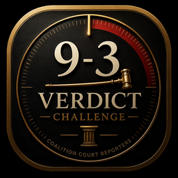
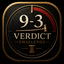
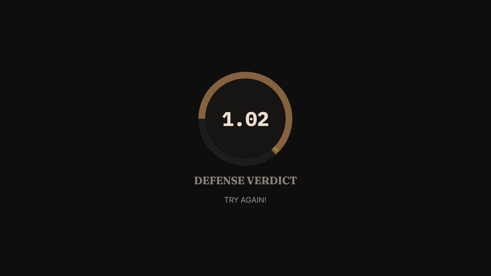
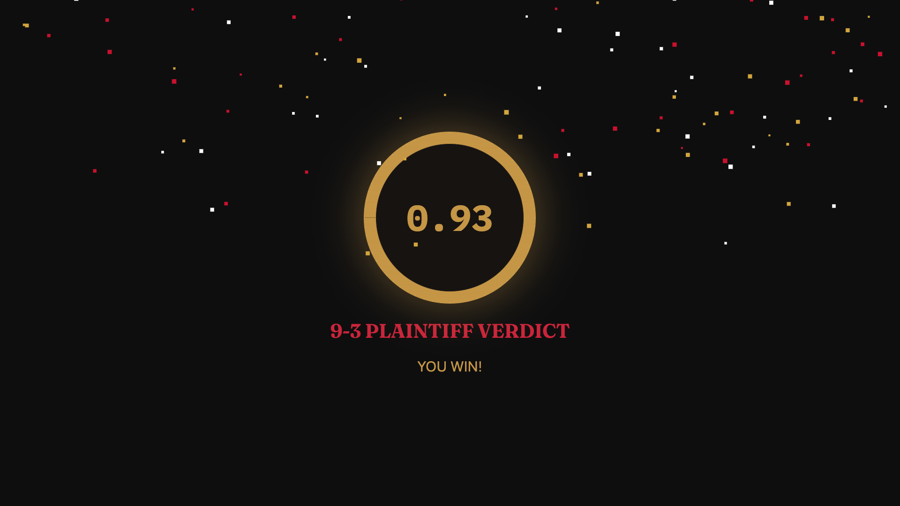

# 9-3 Verdict Challenge

Booth kiosk game for **Acme Court Reporting**. A player presses one physical
red USB arcade button to start a `performance.now()` timer, presses it again to
stop, and tries to land exactly on **0.93 seconds**. Fullscreen Electron + React
kiosk app for a Windows mini PC driving a 43" landscape TV at trade-show booths.
Runs **100% offline** after install.

## App icon

| 256px                              | 128px                              | 64px                              |
| ---------------------------------- | ---------------------------------- | --------------------------------- |
|  |  |  |

Client-supplied, full icon set under `93-media/` (16px through 1024px PNGs,
Windows `.ico`, and an `.icns` source PNG). Wired in as:

- **Windows installer/app icon** — `win.icon` in `electron-builder.yml` →
  `93-media/93-verdict-challenge.ico`.
- **macOS app icon** — `mac.icon` in `electron-builder.yml` →
  `93-media/icon-1024.png` (electron-builder auto-generates the `.icns`).
- **Taskbar/dev-window icon** — `src/main/window.ts` (`BrowserWindow`'s
  `icon` option) and the macOS dev dock icon in `src/main/main.ts`, so it
  shows correctly even before packaging.
- **Browser-tab favicon** — `public/favicon-16.png` / `favicon-32.png`,
  referenced from `index.html`.

## Screenshots

_(from the real running app, not mockups — landscape, the client-confirmed primary orientation)_

| Idle                                      | Win                                     | So Close                                      |
| ----------------------------------------- | --------------------------------------- | --------------------------------------------- |
|  |  |  |

The idle/running/result screens use a "digital courtroom dial" visual identity:
a courtroom-clock-style ring (fine tick marks, a fixed brass target mark, a
conic-gradient fill that always reflects the real elapsed time — see
[Design system](#design-system) below) built around the game's own subject
matter (a legal verdict + timing challenge) rather than a generic dashboard
look. Typography is [Fraunces](https://github.com/undercasetype/Fraunces)
(display serif) and [IBM Plex Mono](https://github.com/IBM/plex) (digits/
labels), both open-license (SIL OFL) and bundled locally — no CDN, no
Google Fonts, no client-supplied font required.

_(The client-supplied art in `93-media/` is the app's own icon/badge — see
[App icon](#app-icon) above. A separate branded Acme Court Reporting
*company* logo (for the small circular "C" seal in the top-left of the idle
screen) hasn't been supplied yet, so that seal is still a placeholder built
from the app's own theme.)_

## Development

```
npm install
npm run dev
```

Runs the app in Vite dev mode with the Electron main/preload processes
rebuilt on change.

## Production build

```
npm run build
```

Type-checks the project (`tsc -b --noEmit`) and builds the renderer, Electron
main process, and preload script into `dist/` and `dist-electron/`.

## Windows packaging

```
npm run package
```

Runs `npm run build` and then `electron-builder`, producing an NSIS installer
and a portable `.exe` in `release/` (see `electron-builder.yml`). This pipeline
has been verified end-to-end on macOS (producing a `.dmg`/`.zip`, proving the
build steps themselves work) — the actual Windows NSIS/portable targets have
not yet been built or tested on a real Windows machine.

## Admin shortcut

`CTRL+SHIFT+A` — opens/closes the settings panel. Hidden during normal
gameplay; only accessible via this keyboard shortcut. Includes win/near range
editing, sound controls, winner-capture toggle, input key selection, a
hardware **TEST BUTTON** diagnostic, a **VIEW LOGS** diagnostic, and a
**VIEW WINNERS** list (Name, Law Firm, Email — staff-only; email is never
shown on the public idle-screen rotation).

## Exit shortcut

`CTRL+SHIFT+Q` — quits the kiosk app. This is never mapped to the arcade
button, so booth attendees cannot accidentally close the app.

## USB button configuration

The arcade button must emulate a standard USB HID keyboard, sending the
default key `SPACE` when pressed. The key can be changed in
**Admin Panel → Input Key**. Verify detection at any time via
**Admin Panel → TEST BUTTON**. Mouse/touch click anywhere on the Idle or
Running screen works identically as a backup input path.

## Settings

All gameplay settings — win/near ranges, auto-reset behavior, sound, winner
capture, and the input key — are editable in the Admin Panel and persisted
locally on disk via `electron-store`. No settings are stored remotely or
require network access. Changes take effect immediately, live, without an
app restart.

## Winner capture

Only actual wins prompt for details (Name, Law Firm, Email — entered via a
full on-screen keyboard, no physical keyboard required). Email is retained
locally but never displayed publicly; only the name rotates on the idle
screen under the "Recent Verdicts" heading. **Admin Panel → CLEAR
TODAY'S WINNERS** removes all captured records.

## Local data location

- Windows (production target): `%APPDATA%/93-verdict-challenge/`
- macOS (dev machine): `~/Library/Application Support/93-verdict-challenge/`

Contains `settings.json` and `winners.json`, both managed by `electron-store`.

## Design system

| Token                     | Value                 | Use                                |
| ------------------------- | --------------------- | ---------------------------------- |
| `--ink`                   | `#0b0b0c`             | Base background                    |
| `--panel`                 | `#17120f`             | Dial face / card background        |
| `--red` / `--red-bright`  | `#9e1b32` / `#c8283f` | Primary accent, running-state ring |
| `--brass` / `--brass-dim` | `#c7a045` / `#8c6d3f` | Win/near accent, target mark       |
| `--parchment`             | `#ede3d0`             | Primary text                       |
| `--ink-muted`             | `#948b7f`             | Secondary text                     |

Fonts and colors are defined once in `src/renderer/styles/theme.css` as CSS
custom properties with fallbacks — every component inherits them
automatically. The dial's fill percentage is always derived from the real
elapsed/result seconds (`secondsToFillPercent()` in `Dial.tsx`), never a
fixed per-outcome constant, so the ring visually "freezes" exactly where an
attempt actually stopped.

## Troubleshooting

- **Arcade button not responding:** open **Admin → TEST BUTTON** to confirm
  HID detection. If the button is disconnected or malfunctioning, fall back
  to the `SPACE` key on an attached keyboard, which triggers the same input
  path.
- **App not fullscreen:** kiosk mode is enabled by default in
  `src/main/main.ts`. If the window appears at the wrong resolution, check
  Windows display scaling settings (see `docs/windows-booth-setup.md`).
- **No sound:** audio files (win/near/other/start/stop) are still
  client-supplied placeholders — the app is designed to fail gracefully (no
  crash, just silence) when a file is missing. Confirm system volume isn't
  muted once real audio files are added under
  `src/renderer/assets/audio/`.

## Offline verification

Disconnect all networking after install and confirm the full game loop,
admin panel, winner capture, and audio all continue to work. The codebase
was audited (grep across `src/` for `http://`, `https://`, `fetch(`,
`googleapis`, CDN references, etc.) and found to have zero network/remote-
asset dependencies — see `docs/qa-results.md` for the full result.

## What's still pending

- Real hardware testing — no physical display or arcade button has been
  available during development; every screen has been verified either by
  code review or, once, via a live screenshot session against the actual
  running app (keyboard and mouse-click input confirmed working on a real
  screen). The physical arcade button itself is still untested.
- Windows NSIS/portable installer has never been built or run on an actual
  Windows machine.
- Windows auto-launch-on-boot is documented (`docs/windows-booth-setup.md`)
  but not scripted or tested.

See `docs/qa-results.md` for the full acceptance-criteria checklist.

## Further documentation

- `docs/hardware-setup.md` — USB arcade button wiring and HID verification.
- `docs/windows-booth-setup.md` — Windows kiosk PC configuration for the
  show floor.
- `docs/qa-results.md` — automated test results and the manual
  hardware/endurance QA checklist.
